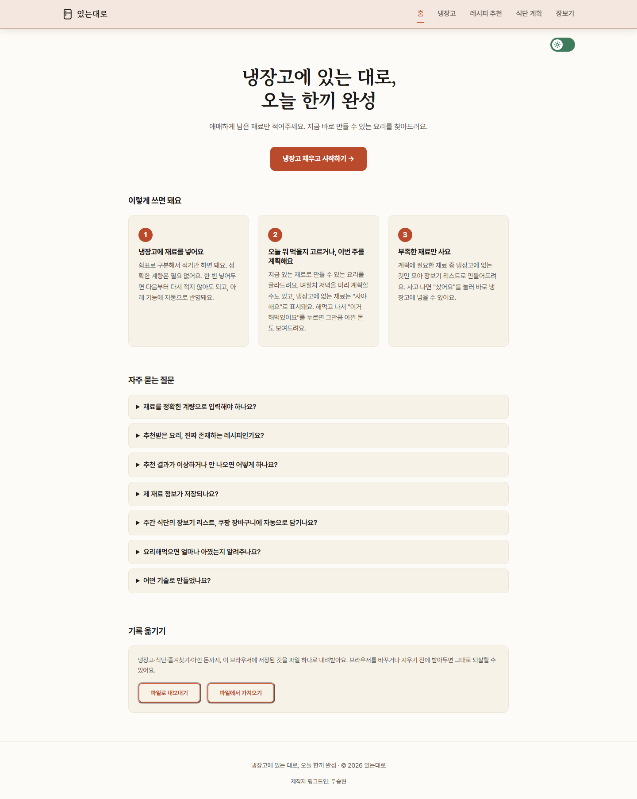
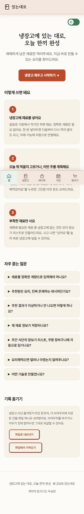
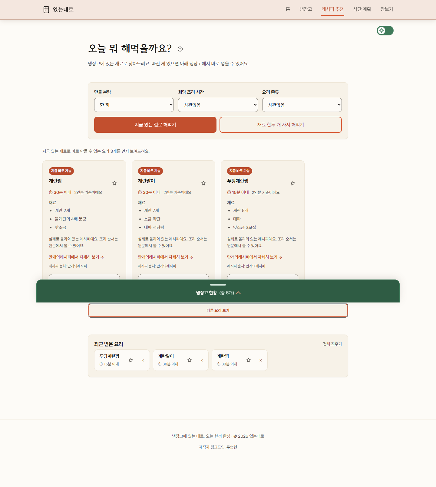

# 있는대로

> 냉장고에 있는 재료를 먼저 쓰고, 부족한 것만 사도록 돕는 1인 가구용 요리 생활 서비스

## 바로 사용해보기

### [▶ 배포된 서비스 실행하기](https://fridge-chef-gamma.vercel.app)

**배포 주소:** https://fridge-chef-gamma.vercel.app

[GitHub 저장소](https://github.com/Frost0313z/fridge-chef) · [서비스 기획서](docs/서비스기획서.md) · [린 캔버스](docs/린캔버스.md)

## 이런 문제를 해결합니다

식비를 아끼려고 직접 요리해도 냉장고 재료를 모두 기억하기는 어렵습니다. 무엇을 만들지 정하지 못하면 이미 있는 재료를 두고 다시 장을 보거나, 결국 배달로 한 끼를 해결하게 됩니다.

**있는대로**는 사용자가 매일 마주하는 세 가지 질문에 답합니다.

1. **냉장고에 무엇이 있지?**
2. **오늘 무엇을 해 먹지?**
3. **다음에 무엇을 사야 하지?**

## 누구를 위한 서비스인가요?

- 혼자 살며 직접 요리하지만 냉장고 재료를 자주 잊는 사람
- 배달비와 식비를 줄이고 싶은 20~30대 1인 가구
- 복잡한 재고 관리보다 빠른 추천과 간단한 기록을 원하는 사람
- 식단을 계획해도 실제 장보기와 냉장고 상태를 연결하기 어려운 사람

## 있는대로의 해결 방식

| 사용자의 문제 | 있는대로의 해결 |
| --- | --- |
| 보유 재료와 소비기한을 기억하기 어렵다 | 냉장고에 재료를 기록하고 일반 재료와 기본 양념을 구분한다 |
| 가진 재료로 무엇을 만들지 바로 떠오르지 않는다 | “지금 바로 만들기”와 “조금만 장보기”로 선택을 단순화한다 |
| 식단과 실제 냉장고 상태가 따로 관리된다 | 미완료 식단과 현재 재료를 비교해 부족한 것만 장보기 목록으로 만든다 |
| 요리 후에도 사용한 재료가 냉장고에 남아 있다 | 사용 항목을 확인한 뒤 냉장고에서 차감하고 필요하면 되돌린다 |
| 직접 요리한 효과를 체감하기 어렵다 | 요리 완료를 주간·월간·누적 절약 현황으로 보여 준다 |

### 핵심 차별점

- 냉장고 정보를 요리 추천·식단·장보기·요리 완료가 함께 사용합니다.
- 실제 레시피 데이터를 먼저 검색하고, 적합한 결과가 부족할 때만 인공지능으로 보완합니다.
- 추천만 보여 주는 데서 끝나지 않고 재료 소비와 다음 장보기까지 연결합니다.
- 인공지능과 사진 분석 결과를 자동 확정하지 않고 사용자가 최종 확인합니다.

> 더 자세한 제품 목적·기능 범위·운영 제약은 [서비스 기획서](docs/서비스기획서.md), 고객·문제·가치·사업 가설과 검증 순서는 [린 캔버스](docs/린캔버스.md)를 참고해주세요.

## 서비스 이용 흐름

**있는대로**는 재료 등록부터 요리 완료까지 흩어져 있던 과정을 하나의 흐름으로 연결합니다.

1. 냉장고에 재료와 소비기한을 기록합니다.
2. 가진 재료로 지금 만들 수 있는 요리를 찾습니다.
3. 며칠치 식단을 구성합니다.
4. 부족한 재료만 장보기 목록으로 정리합니다.
5. 요리를 완료하면 냉장고와 절약 현황을 함께 갱신합니다.

실제 레시피 데이터가 조건에 맞으면 출처와 원문 링크를 제공하고, 결과가 부족하면 OpenAI API가 대체 제안을 만듭니다. 단순한 문장 생성 데모가 아니라 사용자 입력이 냉장고·추천·식단·장보기로 이어지는 상호작용형 웹 서비스입니다.

## 배포 서비스

- **프로덕션:** https://fridge-chef-gamma.vercel.app
- **지원 화면:** 모바일, 태블릿, 데스크톱
- **테마:** 라이트 모드, 다크 모드
- **데이터 저장:** 현재 브라우저의 localStorage
- **백엔드:** Vercel Serverless Functions의 Python API

> 계정과 서버 데이터베이스는 아직 없습니다. 냉장고·식단·장보기 기록은 사용 중인 브라우저에만 저장되며 다른 기기와 자동 동기화되지 않습니다.

## 주요 화면과 기능

| 화면 | 경로 | 핵심 기능 |
| --- | --- | --- |
| 홈 | /index.html | 서비스 안내, 냉장고 현황, 주간·월간 절약 금액 |
| 냉장고 | /pantry.html | 재료·소비기한 관리, 기본 재료 구분, 사진 가져오기 |
| 요리 추천 | /recipe.html | 지금 바로 만들기, 조금만 장보기, 실제 레시피 연결 |
| 식단 | /mealplan.html | 여러 날의 저녁 계획, 메뉴 교체, 즐겨찾기, 완료 처리 |
| 장보기 | /shopping.html | 부족한 재료 통합, 구매 상태와 냉장고 반영 |

모든 화면은 상단 또는 모바일 하단 내비게이션으로 이동할 수 있습니다.

## 화면 미리보기

### 데스크톱

### 모바일

### 실제 레시피 추천 결과

화면을 크게 수정한 경우 같은 기준으로 데스크톱, 모바일, 인공지능 또는 실제 레시피 추천 결과를 다시 촬영합니다.

## 인공지능 기능

### 1. 재료 기반 요리 추천

| 구분 | 내용 |
| --- | --- |
| 입력 | 냉장고 재료, 추가 재료, 원하는 분량, 요리 종류, 추천 모드 |
| 처리 | 실제 레시피 인덱스를 먼저 검색하고 조건에 맞는 결과가 부족하면 OpenAI API 호출 |
| 출력 | 요리명, 재료, 예상 시간, 인분, 추천 이유 또는 실제 레시피 원문 링크 |
| 사용자 가치 | 가진 재료를 우선 소비하고 메뉴 결정 시간을 줄임 |

추천 모드는 사용자의 의도를 분명하게 나눕니다.

- **지금 바로 만들기:** 부족한 재료가 없는 결과를 우선합니다.
- **조금만 장보기:** 추가 구매가 가장 적은 결과를 우선합니다.

### 2. 식단 생성

사용자가 고른 기간과 냉장고 재료를 바탕으로 여러 날의 저녁 메뉴를 제안합니다. 생성 결과는 사용자가 직접 교체하고 확정할 수 있으며, 미완료 식단의 부족 재료만 장보기 목록에 반영합니다.

### 3. 냉장고 사진 가져오기

영수증이나 장보기 내역 사진을 분석해 재료 후보와 구매일을 추출합니다. 분석 결과는 바로 저장되지 않으며, 사용자가 이름과 선택 상태를 확인한 항목만 냉장고에 들어갑니다.

### 실패 처리

| 상황 | 처리 |
| --- | --- |
| 필수 입력이 비어 있음 | 필요한 입력을 구체적으로 안내하고 요청을 보내지 않음 |
| API가 4xx 또는 5xx를 반환함 | 기술 용어 대신 잠시 후 다시 시도하도록 안내 |
| 네트워크가 끊기거나 응답이 지연됨 | 로딩 상태를 표시하고 타임아웃 뒤 재시도 방법 안내 |
| AI 응답 형식이 잘못됨 | 서버에서 형식을 검증하고 안전한 오류 응답으로 변환 |
| 실제 레시피 인덱스가 없음 | 서비스 전체를 중단하지 않고 AI 추천으로 전환 |
| 사진에서 재료를 찾지 못함 | 냉장고를 변경하지 않고 다른 사진 사용을 안내 |

### 대표 테스트 시나리오

| 시나리오 | 입력 예시 | 기대 결과 |
| --- | --- | --- |
| 정상 추천 | 김치, 두부, 대파, 계란 | 만들 수 있는 요리 카드와 보유·부족 재료 표시 |
| 빈 입력 | 냉장고와 추가 재료가 모두 비어 있음 | 재료를 먼저 입력하라는 안내 표시 |
| 긴 입력 | 여러 재료와 조건을 함께 입력 | 로딩 상태 후 결과 표시 또는 타임아웃 안내 |
| 실제 데이터 결과 | 인덱스와 일치하는 재료 조합 | 출처와 만개의레시피 원문 링크 표시 |
| API 실패 | 네트워크 차단 또는 서버 오류 | 냉장고 데이터를 유지하고 재시도 안내 |

## 동작 구조

    사용자 입력
        ↓
    JavaScript가 입력 검증 및 요청 데이터 구성
        ↓ fetch('/api/recommend' 등)
    Vercel Serverless Function: api/index.py
        ↓
    기능별 Python 모듈
        ├─ 실제 레시피 검색
        ├─ OpenAI API 호출
        └─ 응답 형식과 재료 검증
        ↓ JSON 응답
    JavaScript가 로딩 상태를 해제하고 결과를 화면에 렌더링
        ↓
    사용자가 확정한 데이터만 localStorage에 저장

### 프론트엔드와 백엔드의 역할

- **HTML:** 페이지의 제목, 입력 폼, 내비게이션, 결과 영역처럼 의미와 구조를 만듭니다.
- **CSS:** 반응형 레이아웃, 라이트·다크 테마, 상태별 시각적 계층을 담당합니다.
- **JavaScript:** 사용자 입력 검증, fetch 요청, 응답 렌더링, 브라우저 데이터 저장을 담당합니다.
- **Python API:** 비밀 키를 보호하면서 OpenAI API를 호출하고, 실제 레시피 검색과 응답 검증을 수행합니다.
- **Vercel:** 정적 프론트엔드와 요청할 때 실행되는 Python 서버리스 함수를 함께 배포합니다.

서버리스 함수는 계속 켜져 있는 전용 서버 대신 요청이 들어올 때 실행됩니다. 프론트엔드는 같은 서비스의 /api/... 경로를 호출하므로 API 키를 브라우저에 노출하지 않습니다.

## 기술 스택

| 영역 | 기술 | 선택 이유 |
| --- | --- | --- |
| 화면 구조 | HTML5 | 프레임워크 없이 웹의 기본 구조를 직접 학습 |
| 디자인 | CSS3 | 반응형, 디자인 토큰, 다크 모드 구현 |
| 상호작용 | Vanilla JavaScript | 입력부터 fetch와 화면 반영까지 흐름을 직접 구현 |
| 백엔드 | Python | 이전 학습 내용 활용, 데이터 정규화와 API 처리 |
| 인공지능 | OpenAI API | 추천, 식단, 사진 분석 결과 생성 |
| 배포 | Vercel | 정적 파일과 Python Serverless Functions 통합 배포 |
| 데이터 | KADX 만개의레시피, localStorage | 실제 레시피 매칭과 서버 없는 사용자 상태 저장 |
| 버전 관리 | Git, GitHub | 변경 이력과 원격 저장소 관리 |

React나 Vue 같은 프레임워크와 별도 번들러는 사용하지 않았습니다.

## 프로젝트 구조

    fridge-chef/
    ├─ index.html               홈
    ├─ pantry.html              냉장고
    ├─ recipe.html              요리 추천
    ├─ mealplan.html            식단
    ├─ shopping.html            장보기
    ├─ css/
    │  ├─ tokens.css            색상·간격·폰트 디자인 토큰
    │  └─ style.css             공통·반응형 스타일
    ├─ js/
    │  ├─ shared.js             공통 저장·재료 처리
    │  ├─ copy.js               사용자 문구
    │  └─ *.js                  화면별 로직
    ├─ api/
    │  ├─ index.py              API 단일 진입점과 라우팅
    │  ├─ recommend.py          요리 추천
    │  ├─ mealplan.py           식단·장보기 계산
    │  ├─ pantry_import.py      사진에서 재료 후보 추출
    │  └─ recipe_match.py       실제 레시피 검색
    ├─ scripts/
    │  ├─ build_recipe_index.py 실제 레시피 인덱스 생성
    │  └─ deploy.sh             인덱스 검사와 프로덕션 배포
    ├─ docs/                    기획서·기능 명세·증빙
    ├─ requirements.txt
    └─ vercel.json

## 로컬 실행

### 준비물

- Git
- Python 3
- Node.js
- Vercel CLI
- OpenAI API 키

### 1. 저장소 받기

    git clone https://github.com/Frost0313z/fridge-chef.git
    cd fridge-chef

### 2. Python 패키지 설치

    python -m pip install -r requirements.txt

### 3. 환경 변수 설정

.env.example을 복사해 .env를 만들고 실제 키를 입력합니다.

    OPENAI_API_KEY=여기에_발급받은_키_입력

- .env는 Git에 커밋하지 않습니다.
- 키를 README, 자바스크립트, 스크린샷에 노출하지 않습니다.
- 노출이 의심되면 기존 키를 즉시 폐기하고 새로 발급합니다.

### 4. 실행

정적 화면만 확인할 때:

    python -m http.server 8000

브라우저에서 http://localhost:8000 에 접속합니다. 추천·식단·사진 분석 API까지 확인할 때:

    vercel dev

Vercel CLI가 표시한 로컬 주소로 접속합니다.

## API

| 방식 | 경로 | 역할 |
| --- | --- | --- |
| GET | /api | 서버 상태 확인 |
| POST | /api/recommend | 재료 기반 요리 추천 |
| POST | /api/mealplan | 저녁 식단 생성 |
| POST | /api/shopping | 확정 식단의 장보기 목록 재계산 |
| POST | /api/pantryImport | 사진에서 재료 후보 추출 |

모든 POST 요청은 JSON을 사용하며, api/index.py가 기능별 모듈로 전달합니다.

## 테스트

    python api/test_handlers.py
    node js/test_amounts.js

자동 테스트에서는 다음을 확인합니다.

- 빈 입력, 잘못된 AI 응답, API 내부 오류
- 실제 레시피 매칭과 인덱스 누락 폴백
- 재료명·수량·단위 정규화
- 식단과 장보기 부족분 계산
- 요리 완료와 되돌리기
- 주간·월간·누적 절약 계산
- 사진 분석 결과 필터링

화면 변경은 최소 두 크기에서 확인합니다.

- 모바일: 약 390px
- 데스크톱: 약 1920px
- 각 크기의 라이트·다크 모드
- 내비게이션, 입력, 로딩, 결과, 오류 상태

## Vercel 배포

### 환경 변수 등록

Vercel 프로젝트의 Settings → Environment Variables에서 OPENAI_API_KEY를 등록합니다. Production, Preview, Development 중 필요한 환경을 선택합니다.

### 프로덕션 배포

이 프로젝트의 실제 레시피 인덱스는 데이터 라이선스와 파일 크기 때문에 GitHub에 올리지 않습니다. 따라서 GitHub 푸시만으로 끝내지 않고, 로컬 인덱스 존재 여부를 확인하는 전용 스크립트를 사용합니다.

    bash scripts/deploy.sh

배포 스크립트는 다음을 확인합니다.

1. 실제 레시피 인덱스 파일 존재
2. 서버 코드와 인덱스 형식 버전 일치
3. Vercel 프로덕션 배포 성공
4. 배포 URL의 기본 응답

### 배포 후 문제 해결

1. 배포 URL에서 내비게이션과 API 기능을 다시 실행합니다.
2. vercel logs로 서버 함수 오류를 확인합니다.
3. 로컬에서 같은 입력을 재현하고 원인을 수정합니다.
4. 자동 테스트를 통과시킨 뒤 다시 배포합니다.
5. 긴급한 경우 Vercel 대시보드에서 직전 정상 배포를 프로덕션으로 승격합니다.

로컬은 파일과 환경 변수를 개발자 컴퓨터에서 읽지만, 배포 환경은 Vercel 빌드 결과와 등록된 환경 변수만 사용한다는 차이가 있습니다.

## 보안과 운영 기준

- OpenAI API 키는 Python 서버에서만 읽습니다.
- API 키와 .env, 원본 레시피 CSV, 개인 백업은 Git에 올리지 않습니다.
- AI 호출에는 과금과 사용량 제한이 있으므로 빈 입력과 중복 요청을 프론트에서 먼저 차단합니다.
- 네트워크 오류와 잘못된 AI 응답을 정상 사용자 오류로 변환합니다.
- localStorage 값은 사용자가 바꾸거나 이전 버전 형식일 수 있으므로 읽을 때 검증합니다.
- 실제 레시피 원문의 소개와 조리 순서를 복제하지 않고 출처 링크로 연결합니다.

## 미션 요구 사항 충족 현황

| 평가 항목 | 구현 내용 | 상태 |
| --- | --- | :---: |
| 배포된 웹 서비스 | Vercel 프로덕션 URL 공개 | ✅ |
| 3개 이상 페이지 | 홈·냉장고·추천·식단·장보기 5개 화면 | ✅ |
| 메뉴 이동 | 데스크톱 상단, 모바일 하단 내비게이션 | ✅ |
| 반응형 | 모바일·태블릿·데스크톱 레이아웃 | ✅ |
| AI 입력 → 출력 | 추천·식단·사진 분석 기능 | ✅ |
| 실패 처리 | 빈 입력·API 오류·타임아웃·잘못된 응답 처리 | ✅ |
| 프론트·백엔드 분리 | HTML/CSS/JS와 api/ Python 구조 | ✅ |
| 환경 변수 | OPENAI_API_KEY를 로컬·Vercel 환경 변수로 관리 | ✅ |
| GitHub 저장소 | 코드와 커밋 이력 공개 | ✅ |
| 서비스 기획서 | 목적·타겟·기능·지표 정리 | ✅ |
| 화면 증빙 | 데스크톱·모바일·추천 결과 이미지 | ✅ |
| AI 도구 사용 증빙 | 대화 기록 HTML 보관 | ✅ |
| 보너스 UX | 다크 모드, 상태 전환, 되돌리기 | ✅ |

## 문서와 제출 자료

- [서비스 기획서](docs/서비스기획서.md): 목적, 사용자, 페이지와 핵심 기능
- [린 캔버스](docs/린캔버스.md): 고객·문제·가치·사업 가설과 검증 순서
- [UI·UX 원칙](docs/UIUX원칙.md): 반응형, 접근성, 화면 구조
- [레시피 매칭 명세](docs/spec-recipe-match.md): 실제 데이터, 라이선스, 매칭과 배포
- [냉장고 사진 가져오기 명세](docs/spec-pantry-photo-import.md): 입력·출력·확인 흐름
- [요리 완료·자동 반영 명세](docs/spec-auto-restock.md): 냉장고·식단·절약 반영
- [AI 코딩 도구 사용 기록](docs/ai-coding-log.html): 대화 로그 증빙
- 화면 증빙: 이 README의 “화면 미리보기” 3장

## 데이터 출처와 라이선스

실제 레시피 매칭에는 KADX의 만개의레시피 데이터를 사용합니다.

- 데이터 라이선스: CC BY-NC-ND
- 서비스는 재료, 시간, 인분 같은 사실 정보와 원문 링크만 사용합니다.
- 원문의 소개글과 조리 순서는 복제하거나 재배포하지 않습니다.
- 원본 CSV와 생성 인덱스는 공개 저장소에 포함하지 않습니다.
- 이 데이터에 의존하는 현재 기능은 비상업적 범위에서 운영합니다.

자세한 사용 경계와 무결성 정보는 [레시피 매칭 명세](docs/spec-recipe-match.md)를 확인해주세요.

## 만든 과정에서 배운 점

이 프로젝트를 통해 다음 흐름을 직접 구현하고 설명할 수 있게 되었습니다.

- HTML, CSS, JavaScript가 구조·표현·동작으로 나뉘는 이유
- 사용자 입력이 fetch 요청과 JSON 응답을 거쳐 화면에 표시되는 과정
- Vercel Serverless Functions에서 Python 백엔드가 실행되는 방식
- 환경 변수로 비밀 키를 브라우저와 저장소에서 분리하는 이유
- 로컬과 배포 환경의 차이를 추적하고 재배포하는 과정
- AI가 생성한 코드를 자동 테스트, 로그, 재현 입력으로 검증하고 수정하는 방법
- 실제 데이터의 라이선스를 기능 설계 단계에서 제한 조건으로 반영하는 방법
