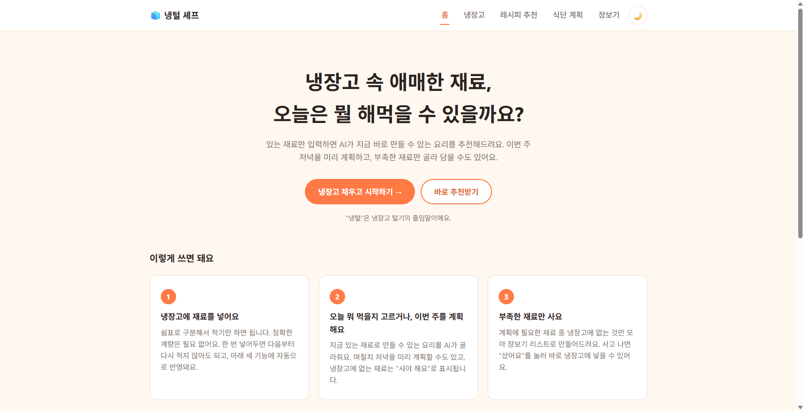
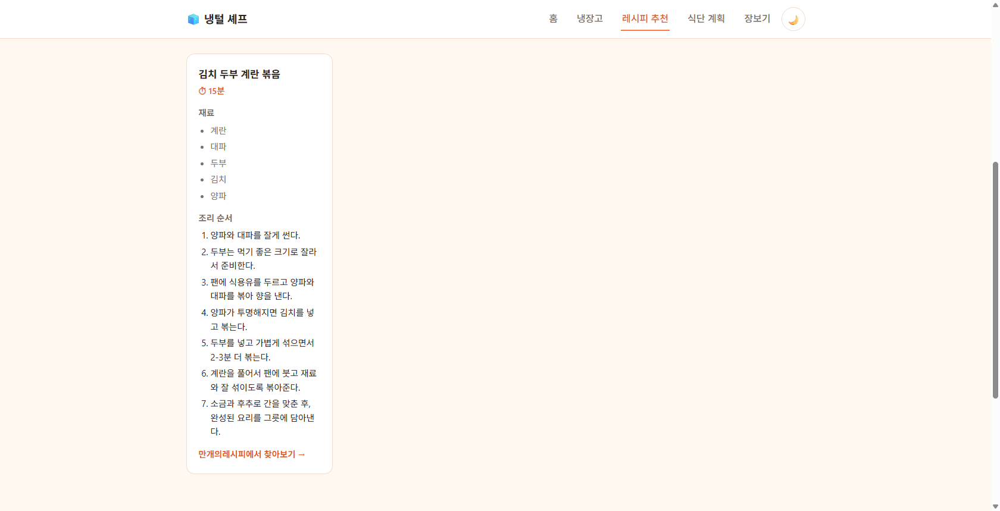
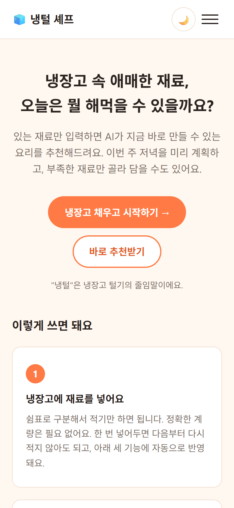
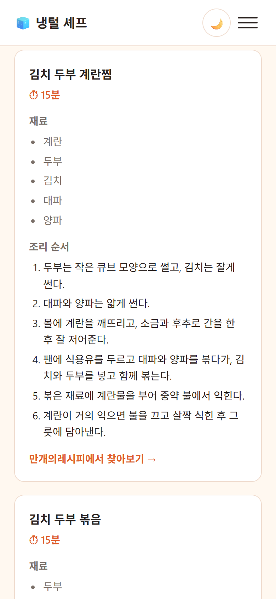
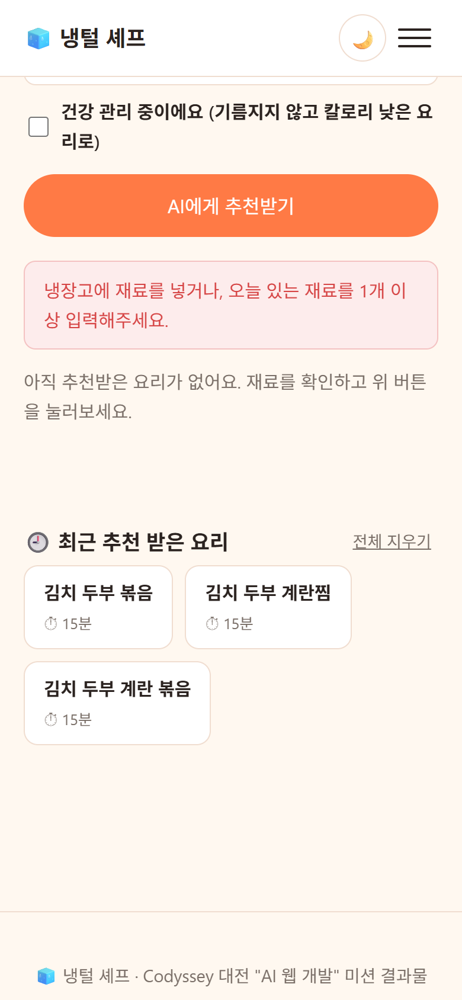

# 🧊 냉털 셰프 (fridge-chef)


-3776AB?logo=python&logoColor=white)


**냉장고에 있는 재료만 입력하면, AI가 지금 바로 만들 수 있는 요리를 추천해주는 웹 서비스입니다.**
"뭘 해먹지?"를 고민하는 대신 재료를 입력하면, 요리 이름부터 조리 순서까지 한 번에 확인할 수 있습니다.

Codyssey 대전 캠퍼스 "AI 웹 개발: 내 아이디어를 현실로, AI 웹 서비스 빌딩" 미션 결과물입니다.

🔗 **배포 URL**: **https://fridge-chef-gamma.vercel.app** (Vercel 프로덕션)

> [!NOTE]
> **목차**
>
> - [💡 무엇을, 어떻게 하나요?](#-무엇을-어떻게-하나요)
> - [🚀 빠른 시작 (로컬 실행)](#-빠른-시작-로컬-실행)
> - [🖥️ 실행 화면](#️-실행-화면)
> - [📋 기능](#-기능)
> - [☁️ 배포 (Vercel)](#️-배포-vercel)
> - [🔑 API 키 설정 방법](#-api-키-설정-방법)
> - [⚠️ API 키 유출 주의사항](#️-api-키-유출-주의사항)
> - [🧱 프로젝트 구조](#-프로젝트-구조)
> - [🛠️ 개발 환경 확인](#️-개발-환경-확인)
> - [🧠 설계 노트](#-설계-노트) — AI 응답 스키마 강제, 실패 처리 3종, **장보기 산수를 AI에서 코드로 옮긴 이유**, 재료 이름 비교 규칙, 홈 진입 동선, 빈 냉장고 처리, 반응형·접근성 전략
> - [📄 서비스 기획서](./docs/서비스기획서.md)
> - [📐 UI/UX 원칙](./docs/UIUX원칙.md) — 안전(해를 끼치지 않는다) 7 · 배려(실제로 돕는다) 8 · 디자인(설명 없이 이해된다) 10, 그리고 완료 체크리스트(D-0 ~ D-0f) / 남은 것
> - [📄 라이선스](#-라이선스)

---

## 💡 무엇을, 어떻게 하나요?

동작은 딱 세 단계입니다.

```
"계란 2개, 대파, 두부 있는데 뭐 해먹지?"
        │
        ▼
1️⃣ [브라우저] 재료 입력 폼에 입력       ──▶  fetch('/api/recommend')
        │
        ▼
2️⃣ [Vercel Serverless Function] 입력을 받아 OpenAI API 호출
        │  (재료 → JSON 형식의 요리 1~3개 요청)
        ▼
3️⃣ [브라우저] 추천 요리 카드로 표시     ──▶  이름 / 예상 시간 / 재료 / 조리 순서
```

<br>

프론트엔드(브라우저)는 사용자 입력을 받아 백엔드(Vercel Serverless Function)에 `fetch`로 요청만 보내고,
실제로 OpenAI API를 호출하는 부분은 전부 서버에서 처리합니다. API 키가 브라우저에 노출되지 않는 이유가 여기에 있습니다.

빈 입력, API 오류, 응답 지연 세 가지 실패 상황에서는 프로그램이 멈추지 않고 사용자에게 안내 메시지를 보여줍니다 — 왜 이렇게 설계했는지는 [설계 노트](#-설계-노트)에서 다룹니다.

---

## 🚀 빠른 시작 (로컬 실행)

이 프로젝트는 Vercel Serverless Functions(Python)를 사용하므로, 백엔드까지 포함한 완전한 로컬 실행은 [Vercel CLI](https://vercel.com/docs/cli)가 필요합니다.

```bash
git clone https://github.com/Frost0313z/fridge-chef.git
cd fridge-chef

cp .env.example .env   # .env에 실제 OPENAI_API_KEY 입력

npm install -g vercel   # 최초 1회
vercel dev              # http://localhost:3000 에서 프론트+백엔드 동시 실행
```

프론트엔드 화면만 빠르게 확인하려면 (AI 기능은 동작하지 않음):

```bash
python -m http.server 8000
# http://localhost:8000/index.html 접속
```

---

## 🖥️ 실행 화면

아래 화면은 모두 **배포된 사이트**(https://fridge-chef-gamma.vercel.app)에서 직접 캡처한 것입니다.
로컬 개발 서버가 아니라 실제 배포본이며, AI 응답도 그 자리에서 받은 실제 응답입니다.

### 데스크톱 (1680px)

| 홈 | AI 추천 결과 |
|---|---|
|  |  |

### 모바일 (390×844, iPhone 상당)

| 홈 | AI 추천 결과 |
|---|---|
|  |  |

데스크톱에서 가로로 놓이던 네비게이션이 **햄버거 메뉴**로, 카드 그리드가 **1열**로 바뀝니다.

### AI 기능 동작 예시

```
입력: 냉장고(계란, 대파, 두부, 김치, 양파) / 두 끼 (내일 점심까지) / 15분 이내

→ 추천 결과
① 김치 두부 계란찜  ⏱ 15분
   재료: 계란 · 두부 · 김치 · 대파 · 양파
   조리 순서: 1. 두부는 작은 큐브 모양으로 썰고, 김치는 잘게 썬다
              … 6. 계란이 거의 익으면 불을 끄고 살짝 식힌 후 그릇에 담아낸다
   [만개의레시피에서 찾아보기 →]  (검색어: "두부계란찜")

② 김치 두부 볶음   ⏱ 15분
   재료: 두부 · 김치 · 대파 · 양파
   [만개의레시피에서 찾아보기 →]  (검색어: "두부볶음")
```

재료 이름이 모두 흐린 회색인 것은 그 재료가 전부 냉장고에 있다는 표시입니다 —
없는 재료였다면 "사야 해요"로 구분됩니다([B2](./docs/UIUX원칙.md#b2-이미-알려준-것을-다시-기억하게-하지-않는다)).

### 실패 처리 — 빈 입력

냉장고가 비어 있고 추가 재료도 적지 않은 채로 제출하면, API를 호출하지 않고 프론트에서 즉시 막습니다.



```
입력: (냉장고 비어 있음) + (추가 재료 빈칸)
→ "냉장고에 재료를 넣거나, 오늘 있는 재료를 1개 이상 입력해주세요."
```

이 문구는 `role="alert"`가 걸려 있어 화면을 보지 못해도 즉시 읽힙니다.
나머지 두 실패(API 오류·응답 지연)의 처리 방식은 [설계 노트](#-설계-노트)를 참고하세요.

### 긴 입력 — 자르지 않고 그대로 보낸다

재료를 30개 이상 늘어놓는 것 같은 긴 입력에서 이 서비스가 **어떻게 행동하는지**를 정리합니다.
결론부터: **레시피 추천은 입력을 자르지 않고, 식단 계획만 30개에서 끊습니다.** 의도한 비대칭입니다.

| 경로 | 입력 상한 | 초과분 처리 | 근거 |
|---|---|---|---|
| 레시피 추천 `POST /api/recommend` | **없음** | 재료 문자열을 그대로 프롬프트에 넣음 | `api/recommend.py` — `handle()`이 `ingredients`를 `strip()`만 하고 `build_user_prompt()`로 넘김 |
| 식단 계획 `POST /api/mealplan` | **30개** | 31번째부터 **조용히 무시** | `api/mealplan.py` — `pantry = [...][:30]` |

**왜 추천 쪽은 자르지 않나.** 재료를 많이 적은 사용자는 "이 중에 되는 걸 골라줘"라는 뜻입니다.
앞에서 30개만 남기고 자르면 **뒤에 적은 재료가 없는 셈이 되어**, 사용자가 분명히 가진 재료를
빼고 추천하게 됩니다. 재료 목록은 길어야 수백 자라서 토큰 한도에 닿지도 않습니다.
반대로 식단 계획은 재료함 전체를 프롬프트에 넣고 **날짜 수만큼 곱해서** 요청하므로,
상한을 두지 않으면 프롬프트가 길어져 응답이 느려집니다. 그래서 여기만 30개로 끊습니다.

**입력이 길어져서 생기는 실패는 "지연"이며, 이미 처리 경로가 있습니다.** 프롬프트가 길수록 응답이
느려지는데, 서버 15초 · 클라이언트 20초(식단은 세 끼라 서버 25초 · 클라이언트 30초) 이중 타임아웃이 걸려 있어 무한 대기 대신
"AI 응답이 지연되고 있어요. 잠시 후 다시 시도해주세요."로 끝납니다([A2](./docs/UIUX원칙.md#a2-실패해도-멈추지-않고-원인별로-다르게-말한다)).

**출력 쪽에도 상한이 있습니다** — AI가 요리를 몇 개를 주든 `MAX_RECIPES = 3`,
식단은 `MAX_DAYS = 7`일 x 3끼, 장보기는 `MAX_SHOPPING_ITEMS = 60`으로 잘라서 내보냅니다
(`api/recommend.py`, `api/mealplan.py`, `api/shopping.py`). 입력이 길어져도 화면이 끝없이 늘어나지는 않습니다.
장보기 상한은 원래 30이었는데, 7일치 21끼면 30종을 넘는 것이 정상이라 **목록 끝을 조용히
잘라먹고 있었습니다.** 지금은 실제 계획이 닿지 않는 높이로 두어 안전장치로만 남깁니다.

> [!NOTE]
> 위 표는 **코드를 읽어 정리한 설계상 동작**입니다. 배포본에 실제로 35개 재료를 넣어 측정한
> 응답 시간·결과는 아직 이 문서에 기록하지 않았습니다.

**30개 초과는 이제 화면이 먼저 알려줍니다.** 예전에는 31번째 재료부터 아무 말 없이 빠져서
"분명 있는데 장보기 리스트에 또 떴다"를 겪어도 원인을 알 방법이 없었습니다. 지금은 냉장고 화면과
조회 바가 **"재료가 35개예요. 식단 계획에는 먼저 넣은 30개만 쓰여서 최근에 넣은 5개는 빠집니다"**를
띄웁니다. 버려지는 쪽이 **최근에 넣은 재료**라는 점까지 말해줘야 무엇을 정리할지 판단할 수 있습니다.
상한값은 `api/mealplan.py`의 `MAX_PANTRY`와 `js/shared.js`의 `MEALPLAN_PANTRY_LIMIT`이 같은 값을
쓰며, 서버 테스트가 두 값의 일치를 확인합니다.

---

## 📋 기능

| 페이지 | 기능 |
|---|---|
| 홈 (`index.html`) | 서비스 소개, 이용 방법 3단계, FAQ, 각 기능 진입점 |
| 냉장고 (`pantry.html`) | 재료를 넣고 빼고 한눈에 보기. 같은 재료를 다시 넣으면 **한 줄로 합쳐 최신 수량으로 갱신**. 평소에는 이름만 보여주고 **"자세히"** 를 누르면 수량과 며칠 전인지까지 확인. **넣은 지 7일이 지나면 "13일 전" 배지**는 항상 표시 |
| 레시피 추천 (`recipe.html`) | 만들 분량/조리시간 입력 → AI 추천 요리 카드. 재료마다 냉장고 보유 여부를 함께 표시 |
| 식단 계획 (`mealplan.html`) | 냉장고 기반 며칠치 **아침·점심·저녁** AI 계획. "메뉴 바꾸기" 모드에서 고르고 놓아 끼니를 옮기거나 삭제. **빈 자리에는 메뉴를 직접 넣을 수 있고**, 최근 추천받은 요리에서 골라 넣으면 재료·레시피 링크까지 따라옴 |
| 장보기 (`shopping.html`) | 식단에 필요한 양에서 냉장고에 있는 만큼을 뺀 **부족분만** 수량과 함께 추출(쿠팡 검색 링크) → "샀어요"로 냉장고에 반영 |

- **오래 둔 재료를 먼저 쓰게 한다** — 냉장고에 넣은 날짜를 자동으로 기록하고(사용자는 아무것도 입력하지 않는다), 7일이 지나면 화면에 `13일 전`으로 표시한다. AI에게도 함께 알려서 그 재료를 쓰는 요리를 먼저 추천하고, 식단에서는 앞쪽 날짜에 배치하게 한다. **버리는 재료가 곧 버리는 돈**이라는 게 이 서비스의 전제다
- **어디서나 냉장고 편집** — 나머지 화면도 **화면 아래에 붙는 시트**에서 재료를 추가·삭제할 수 있다. 손잡이를 잡고 위로 끌면 손을 따라 올라오고, 절반을 넘기면 열린다(탭·Enter로도 열린다 — `<details>`의 기본 동작을 그대로 두고 끌기만 얹었다). 처음에는 헤더 바로 아래에 뒀는데, 그러면 **가장 자주 여는 것이 모바일에서 손가락이 가장 닿기 어려운 자리**에 놓인다. 흐름을 끊고 냉장고로 넘어가면 적던 재료와 결과가 날아가기 때문. 삭제에는 **되돌리기**가 붙는다 — 확인창은 맞게 지우는 99번을 방해하고, 되돌리기는 틀린 1번만 구제한다
- **얼마나 사야 하는지는 코드가 센다** — AI는 끼니마다 "무엇이 얼마나 들어가는가"까지만 적고, 21끼치 합산과 냉장고 차감은 `api/shopping.py`가 한다. AI에게 맡겼을 때는 7일치(34종)에서 6종을 통째로 빠뜨렸다 — **냉장고에 조금이라도 있으면 "있다"로 보고 넘어갔다.** 재료 1종·3끼로 격리하면 정확히 맞히므로 프롬프트 문제가 아니라 규모 문제였다
- **왜 이걸 사야 하는지 펼쳐 보여준다** — 줄마다 접혀 있는 **"왜 사야 하나요?"** 를 펼치면 `계획 전체에 21개 필요 · 냉장고에 4개 있어서 뺐음`과 함께 **어느 끼니에 얼마나 쓰이는지**가 나온다(`8/13 (목) 아침 · 계란 스크램블 — 2개`). 결론만 내놓으면 맞는지 틀리는지 판단할 방법이 없고, 특히 "냉장고에 있는데 왜 또?"는 근거를 봐야 풀린다 — 단위가 달라 뺄 수 없었으면 그렇다고 적는다. 숫자는 서버가 계산한 것을 그대로 쓴다(화면에서 다시 세면 근거가 목록과 어긋나 오히려 불신을 만든다)
- **장보기 → 냉장고 고리** — "샀어요"를 누르면 산 수량이 냉장고에 더해지고(계란 4개 + 6개 → 10개), 목록의 그 줄은 그만큼 줄어든다. 6개 중 2개만 채우면 **"4개"로 남고**, 다 채우면 사라진다. 냉장고 화면에서 직접 넣어도 똑같이 반영된다. 단위가 달라 합칠 수 없으면(`1팩` + `150g`) 숫자를 지어내지 않고 무엇을 고쳐야 하는지 알린다
- **추천 재료 중 무엇을 사야 하는지 표시** — 냉장고와 대조해 이미 가진 재료는 흐리게, 없는 재료는 "사야 해요"로 구분 (냉장고가 비어 있으면 표시하지 않음)
- **만개의레시피 상세 레시피 연결** — 추천 요리·식단 메뉴마다 검색 링크. AI에게 검색용 짧은 이름을 따로 받아 정확도를 확보
- **다른 요리 추천받기** — 결과가 마음에 안 들면 폼으로 돌아가지 않고 바로 재추천. 이때는 최근 추천한 요리를 서버로 함께 보내 프롬프트에서 제외하므로, 같은 요리가 다시 나오지 않습니다 (폼을 직접 제출할 때는 제외하지 않습니다)
- 추천 실패 시 최근 추천 이력으로 안내 (볼 이력이 있을 때만)
- 반응형 레이아웃 (데스크톱 / 태블릿 / 모바일 640px 이하에서 햄버거 메뉴 전환)
- AI 실패 처리: 빈 입력 / API 오류(4xx·5xx) / 응답 지연(타임아웃) 각각 별도 안내 메시지
- 키보드·스크린리더 대응: 본문 바로가기 링크, AI 진행/결과 `aria-live` 안내, Esc·바깥 클릭으로 메뉴 닫기
- **[보너스]** 다크 모드 토글 — 선택값을 `localStorage`에 저장, 최초 방문 시 OS 설정(`prefers-color-scheme`)을 따름
- **[보너스]** 내 냉장고 — 자주 쓰는 재료를 `localStorage`에 등록해두면 다음 방문에도 유지되어, 매번 재입력할 필요 없이 그날 추가된 재료만 따로 입력하면 됨
- **[보너스]** 건강 관리 옵션 — 체크하면 기름지지 않고 칼로리 낮은 쪽으로 AI 추천 성격이 바뀜 (초기에는 자취생/가족/다이어트 3지선다였으나, 타겟이 1인 가구로 고정돼 있어 세대 구성과 무관한 축만 남김 — [기획서 "타겟 정합성 점검"](./docs/서비스기획서.md) 참고)
- **만들 분량 선택** — "인원수"가 아니라 "몇 끼 분량"으로 묻는다. 혼자 살아도 두 끼를 만들어 다음 끼니까지 해결하는 게 식비 절약의 핵심 행동이기 때문
- **[보너스]** 최근 추천 이력 — 추천받은 요리를 최대 5개까지 `localStorage`에 저장, 클릭하면 API 재호출 없이 바로 다시 확인 가능
- **[보너스]** 식단 계획 + 장보기 리스트 — 냉장고를 반영해 AI가 3/5/7일치 아침·점심·저녁 식단을 계획하고(계획 후 메뉴를 다른 끼니로 옮기거나 지우거나 **직접 넣을 수 있음**), 식단에 필요한 양에서 냉장고에 있는 만큼을 뺀 나머지를 쿠팡 검색 링크와 함께 보여줌 (장바구니 자동 담기는 하지 않음)

---

## ☁️ 배포 (Vercel)

정적 파일(`*.html`, `css/`, `js/`)과 서버리스 함수(`api/*.py`)를 한 프로젝트로 함께 올립니다.
`api/` 아래 `.py` 파일과 루트 `requirements.txt`가 있으면 Vercel이 Python 함수로 자동 인식하므로,
`vercel.json`은 런타임 지정이 아니라 **보안 헤더 설정용**으로만 두었습니다.

```bash
npm install -g vercel     # 최초 1회
vercel login              # 브라우저 인증

vercel                    # 프리뷰 배포 (프로젝트 최초 연결)
vercel env add OPENAI_API_KEY production   # 서버에서 쓸 API 키 등록
vercel --prod             # 운영 배포
```

> [!IMPORTANT]
> `OPENAI_API_KEY`를 등록하지 않으면 화면은 뜨지만 AI 기능이 "서버에 API 키가 설정되어 있지 않아요."로 응답합니다.
> 키는 서버 환경변수로만 넣고, 저장소에는 절대 커밋하지 않습니다.

### 배포 후 문제가 생겼을 때 — 로그 보기와 되돌리기

배포는 끝이 아니라 시작입니다. 화면은 멀쩡한데 AI 기능만 죽는 상황이 실제로 있었고
(`358b429` 정적 페이지 대신 API 응답만 나오던 문제, `afec11f` Python 빌드 실패),
그때마다 아래 순서로 원인을 찾았습니다.

**1단계 — 어떤 로그를 어디서 보나**

브라우저 콘솔에는 `fetch` 실패만 찍히고, **서버에서 무슨 일이 났는지는 Vercel 쪽 로그에만 남습니다.**
둘은 다른 곳을 보므로 순서대로 확인합니다.

| 보는 곳 | 무엇이 보이나 | 어떻게 |
|---|---|---|
| 브라우저 콘솔·네트워크 탭 | 프론트가 받은 HTTP 상태(400/502/504)와 응답 본문 | F12 → Console / Network |
| **런타임 로그** (함수 실행 중 오류) | `api/*.py`가 던진 예외, `print()` 출력, 실행 시간 | `vercel logs <배포URL> --follow` 또는 대시보드 → 프로젝트 → **Logs** |
| **빌드 로그** (배포 자체가 실패) | `requirements.txt` 설치 실패, 문법 오류 | `vercel inspect <배포URL> --logs` 또는 대시보드 → Deployments → 해당 배포 → **Building** |

```bash
vercel logs https://fridge-chef-gamma.vercel.app --follow   # 실시간 스트리밍
vercel logs https://fridge-chef-gamma.vercel.app --level error   # 오류만
vercel inspect https://fridge-chef-gamma.vercel.app         # 배포 상태·별칭 확인
```

`--follow`는 스트리밍이라 **로그를 띄워둔 채 다른 창에서 기능을 눌러야** 그 요청이 찍힙니다.

**2단계 — 고칠 것인가, 되돌릴 것인가**

```bash
# (a) 원인을 알고 코드로 고칠 수 있다 → 고쳐서 다시 배포
git commit -am "fix: ..." && git push
vercel --prod

# (b) 원인은 모르겠고 방금 배포부터 깨졌다 → 직전 배포로 즉시 되돌리기
vercel rollback <직전_배포URL>

# (c) 코드는 그대로인데 환경변수만 바꿨다 → 재빌드 없이 다시 배포
vercel redeploy <배포URL>
```

**환경변수를 바꾼 뒤에는 반드시 (c)를 해야 합니다.** `vercel env add`는 값만 저장할 뿐
이미 떠 있는 배포에 적용되지 않아서, 재배포 전까지 계속 옛 키로 동작합니다.

되돌리기를 먼저 하고 원인을 찾는 편이 낫습니다 — `rollback`은 이전 배포를 그대로 다시 가리키는
것이라 몇 초면 끝나고, 그동안 서비스는 살아 있는 상태로 디버깅할 수 있기 때문입니다.

---

## 🔑 API 키 설정 방법

1. [OpenAI Platform](https://platform.openai.com/api-keys)에서 API 키를 발급받습니다.
2. **로컬 개발**: `.env.example`을 복사해 `.env`로 저장한 뒤 `OPENAI_API_KEY` 값을 채웁니다. (`.env`는 `.gitignore`에 등록되어 있어 커밋되지 않습니다)
3. **배포(Vercel)**: 프로젝트 대시보드 → Settings → Environment Variables 에서 동일한 이름(`OPENAI_API_KEY`)으로 등록합니다.

## ⚠️ API 키 유출 주의사항

- API 키는 코드/README/스크린샷 어디에도 실제 값으로 노출하지 않습니다.
- 브라우저(프론트엔드)는 API 키를 전혀 알지 못합니다 — 키를 사용하는 모든 호출은 서버(`api/recommend.py`)에서만 이루어집니다.
- 만약 키가 실수로 노출되었다면 즉시 OpenAI 대시보드에서 해당 키를 폐기(Revoke)하고 새로 발급하며, 노출된 커밋이 있다면 히스토리에서도 제거합니다.

---

## 🧱 프로젝트 구조

```
fridge-chef/
├── index.html              # 홈 (소개 · 이용 방법 · FAQ)
├── pantry.html             # 냉장고 (재료 편집 - 단일 출처)
├── recipe.html             # 레시피 추천 (AI 기능)
├── mealplan.html           # 식단 계획 (AI 기능)
├── shopping.html           # 장보기 리스트
├── css/
│   └── style.css           # 전체 페이지 공통 스타일 + 반응형 + 다크 모드 토큰
├── js/
│   ├── main.js             # 반응형 네비게이션(햄버거 메뉴)·다크모드 토글
│   ├── shared.js           # 공용 모듈 — 저장(loadJson/saveJson), 통신(postJson),
│   │                       #   폼 상태(createFormStatus), 냉장고 조회 바/선택값
│   ├── recipe.js           # AI 추천 요청/결과 렌더링/실패 처리, 추천 이력
│   ├── mealplan.js         # 식단 계획 요청/결과 렌더링
│   ├── shopping.js         # 장보기 리스트 렌더링, 샀어요 처리 (무엇을 살지는 서버가 정함)
│   └── test_amounts.js     # 자체 점검 — node js/test_amounts.js (수량 계산)
├── api/
│   ├── index.py            # 유일한 진입점 — HTTP 처리·라우팅·예외를 여기서만 담당
│   ├── _common.py          # 두 기능이 공유하는 OpenAI 호출과 오류 → 한국어 문구 매핑
│   ├── recommend.py        # 재료 기반 요리 추천 (handle 함수만 제공)
│   ├── mealplan.py         # 식단 계획 + 재료 채우기 (AI를 부르는 쪽)
│   ├── shopping.py         # 장보기 목록 계산 — 합산·차감 (AI를 부르지 않는 쪽)
│   └── test_handlers.py    # 자체 점검 — python api/test_handlers.py
├── docs/
│   ├── 서비스기획서.md
│   ├── UIUX원칙.md         # 안전·배려·디자인 3축 판단 기준 + 남은 할 일 체크리스트
│   ├── ai-coding-log.html  # AI 코딩 도구 사용 증빙 로그
│   └── screenshot-*.png    # 배포본 실행 화면 캡처
├── vercel.json             # 배포 설정 (보안 헤더)
├── requirements.txt
├── .env.example
├── LICENSE
└── README.md
```

---

## 🛠️ 개발 환경 확인

<!-- ENV_EVIDENCE_START -->

`python -V`

```
Python 3.14.6
```

`git --version`

```
git version 2.55.0.windows.3
```

`git config user.name / user.email`

```
Drako_Dev
msong7618@gmail.com
```

`git log --oneline --graph --all`

```
* 920fbc7 fix: 저장 실패·손상된 데이터·중복 요리에 화면이 죽거나 거짓말하던 문제
* e946254 fix: 서버 예외가 응답 없이 끊기던 문제와 중복 요리 추천
* d5fffd9 refactor: 장보기의 옛 이름 매칭 계산 경로 제거
* 51a2ff2 refactor: 배포에 실리던 docs·죽은 경로 폴백·중복 저장 키 제거
* defbefb docs: 사전평가에서 지적된 긴 입력 처리와 운영 로그 절차를 README에 추가
* d153a90 docs: 실행 화면 증빙에 모바일·실패 처리 캡처 추가, 안내 문구 변경 반영
* f0e83b7 fix: 화면에 남아 있던 옛 용어 "재료함"을 "냉장고"로 통일
* 34cce16 docs: 개발환경 증빙 git log 갱신
* 4144ad7 docs: 배포 URL과 배포본 실행 화면 캡처를 README에 반영
* c44d03f feat: 장보기 목록을 AI가 수량까지 따져 직접 뽑도록 변경
* a45236f fix: 장보기 리스트에 소금·후추·물 같은 기본 조미료가 섞이던 문제
* 358b429 fix: 배포 사이트에서 정적 페이지 대신 API 응답만 나오던 문제
* b10b15c refactor: Vercel 단일 진입점 구조에 맞춰 api를 라우터 + 기능 모듈로 재구성
* afec11f fix: Vercel Python 빌드 실패 - 레거시 빌더를 명시해 다중 엔드포인트 유지
* adac892 fix: 쿠팡 검색 링크가 빈 검색으로 열리던 문제
* 723be07 docs: 개발환경 증빙 git log 갱신
* 6e89617 docs: 책임 단위 재편을 기획서/README/원칙 문서에 반영
* b29628b fix: 네비 항목이 5개로 늘면서 모바일 메뉴 마지막 항목이 잘리던 문제
* 08f6aa3 feat: 각 화면의 빈 상태와 다음 행동 안내 정비
* 614a78e refactor: 장보기를 별도 페이지로 분리하고 산 재료를 냉장고에 넣는 고리를 닫는다
* 37653cf refactor: 재료함을 냉장고 페이지로 분리하고 나머지 페이지에는 조회 바를 둔다
* aae0eee docs: 개발환경 증빙 git log 갱신
* c8b44ef docs: 페이지 통합을 기획서/README/원칙 문서에 반영
* 6b99c2e refactor: 소개 페이지를 홈으로 통합하고 중복 설명 블록을 하나로 합침
* 5c2ce50 docs: 개발환경 증빙 git log 갱신
* 4f6f3f9 docs: 타겟 정합성 점검 결과를 기획서/README/원칙 문서에 반영
* 5271cc9 refactor: 타겟과 맞지 않는 선택지 정리 (상황 3지선다 -> 건강 여부, 인원수 -> 만들 분량)
* 78d188b docs: 개발환경 증빙 git log 갱신
* 7aa0d76 docs: 개선 결과를 UI/UX 원칙 체크리스트와 README/기획서에 반영
* 0850759 feat: 추천 요리를 만개의레시피에서 찾아보는 링크 추가
* a6193ab feat: 결과 카드 페이드인 추가, 버튼 hover 미세 이동 제거
* 10715a6 refactor: 재료함을 details로 접고 추가 버튼을 secondary로 강등
* 8bec1ac feat: 추천 실패 시 최근 추천 유도 + 다른 요리 재추천 버튼
* e761bb9 feat: 추천 카드에 재료함 보유 여부 표시
* 32058a8 fix: 다크 모드 오류 테두리·모바일 터치 타겟·제출 버튼 폭 수정
* 7711e0a fix: 재료함 조작에 화면 반응이 없던 문제 수정
* b67a96b refactor: 재료명 정규화·보유 판정을 js/shared.js로 이동
* 207ae61 docs: UI/UX 원칙에 디자인 축 추가 및 전체 화면 검토 결과 반영
* 2dda6e4 docs: UI/UX 원칙을 안전 축·배려 축 두 축으로 재구성
* 71f38fe docs: UI/UX 원칙 문서 추가 (docs/UIUX원칙.md)
* 72adc7f docs: 개발환경 증빙 git log 갱신
* a993b29 docs: 홈 진입 동선·빈 재료함 안내 설계 근거를 README/기획서에 반영
* 96b265c fix: 재료함이 비었을 때 장보기 리스트 안내 문구가 사실과 다르던 문제 수정
* 4a68a85 feat: 홈에서 주간 식단 기능도 바로 발견되도록 CTA·기능 카드 보강
* c47a224 docs: 이번 수정의 설계 근거를 README/기획서에 반영, 배포 절차 문서화
* e938660 fix: 헤더 정렬 결함 수정 + 접근성 개선, CSS 중복 규칙 정리
* 9f3b73e fix: 동작 버그 4건 수정 + 프론트/백엔드 방어 로직 보강
* fbcd030 docs: 데스크톱 레이아웃 정렬 수정 내용을 설계 노트에 반영
* 1a205aa fix: 헤더(1080px)와 내부 페이지 콘텐츠(기존 720px) 좌우 정렬 불일치 수정 - 넓은 PC 화면에서 제목/폼이 로고보다 오른쪽에서 시작되던 문제, 재료함/이력 섹션의 이중 패딩 문제, mealplan 폼 select 스타일 누락 문제 함께 해결
* 5fa9c07 docs: UX 마찰 개선 내용을 README/기획서에 반영
* 62a72c0 fix: UX 마찰 개선 - 재료함 쉼표 다중추가, mealplan에서 재료함 직접 수정(공용 js/shared.js로 분리), 인원수/상황 선택값 저장, 전체삭제 confirm 추가
* da86cc3 docs: 주간 식단 계획 기능을 기획서/README/FAQ에 반영
* 48003d0 feat: 주간 식단 계획 + 장보기 리스트 페이지 추가 - 재료함과 비교해 부족한 재료만 추출, 쿠팡 검색 링크 제공
* 5b8fdcc docs: 문제 정의 2차 고도화(식비 절약 욕망 + 3가지 장벽), 주간 식단 계획/장보기 리스트 로드맵 추가
* 5d6e6e5 docs: 문제 정의 고도화 - 진짜 경쟁 상대는 배달앱, 장보기 회피->배달 악순환 관점으로 재정리
* bc5998e docs: 상황 선택/추천 이력 기능을 README와 기획서에 반영
* eeda7a0 feat(보너스): 상황별 말투 옵션 + 최근 추천 이력(로컬 저장) 추가 - careMeal 프로젝트 리뷰에서 착안
* dc7180e fix: 좁은 화면에서 재료함 추가 버튼 텍스트 줄바꿈되는 문제 수정
* ed28206 docs: 내 재료함(데이터 저장 고도화) 보너스 내용을 README/기획서에 반영
* f158c8d feat(보너스): 내 재료함(로컬 저장) 기능 추가 - 자주 쓰는 재료를 브라우저에 저장해 재입력 없이 재사용
* 2080fac docs: 다크 모드 보너스 구현 내용을 README/기획서에 반영
* 771edf3 feat(보너스): 다크 모드 토글 + 제작자 정보 푸터 추가
* 25a5111 docs: AI 코딩 도구 사용 증빙 로그 추가 (개인정보 마스킹 처리)
* 0b82c78 docs: README 작성 (소개/실행방법/기능/API키/구조/설계노트/개발환경 증빙)
* a891da6 docs: 서비스 기획서 작성
* 273b3da feat: 레시피 추천 페이지 + 프론트-백엔드 연동, 실패 처리 UX 구현
* 691958e feat: AI 레시피 추천 백엔드(api/recommend.py) 구현
* 0a0d357 chore: 의존성 정의 및 환경변수 템플릿 추가
* 339bd7e feat: 소개 페이지(이용방법/기술스택/FAQ) 구현
* 46d0bf2 feat: 홈 페이지 + 반응형 네비게이션 골격 구현
* fb1f77d chore: 프로젝트 구조 초기화
```

<!-- ENV_EVIDENCE_END -->

---

## 🧠 설계 노트

개별 결정의 근거를 하나씩 적은 곳입니다. 이 결정들이 공유하는 판단 기준은
[UI/UX 원칙](./docs/UIUX원칙.md)에 따로 정리했습니다.

### AI 응답을 JSON으로 강제한 이유
프론트엔드가 자연어 문장을 파싱하면 AI 응답의 형식이 조금만 달라져도 화면이 깨집니다.
`response_format={"type": "json_object"}`로 응답 형식을 강제하고, 서버가 `recipes` 배열 구조로 한 번 더 검증한 뒤 프론트에 전달하므로,
AI가 "추천 요리는 다음과 같습니다:" 같은 부연 설명을 덧붙여도 화면 렌더링에 영향을 주지 않습니다.

### 실패 처리를 3종으로 나눈 이유
미션 요구사항은 실패 처리 1개 이상이지만, 실제로 발생 가능한 실패는 성격이 다릅니다.
- **빈 입력**: 사용자 실수 → 프론트에서 즉시 막아 API 호출 자체를 아낀다 (요청 비용 절감)
- **API 오류(4xx/5xx)**: OpenAI 쪽 문제 → 서버가 원인을 감추고 "잠시 후 다시 시도" 안내로 통일
- **응답 지연**: 서버 15초 + 클라이언트 20초로 이중 타임아웃을 걸어, 서버가 먼저 끊어도 클라이언트가 무한 대기하지 않도록 한다

### 반응형을 브레이크포인트 2단계로 설계한 이유
데스크톱(3열 카드) → 태블릿 900px(2열) → 모바일 640px(1열 + 햄버거 메뉴) 3단계로 나눴습니다.
페이지 종류가 적어 복잡한 그리드 시스템 대신 `grid-template-columns`를 구간별로 직접 지정하는 방식이
코드량 대비 유지보수가 더 쉽다고 판단했습니다.

### 페이지 콘텐츠 폭을 헤더와 통일한 이유
초기 버전은 홈 화면 히어로(1080px)와 나머지 페이지의 본문(`.page`, 720px)이 서로 다른 폭으로
각자 `margin: 0 auto`로 중앙정렬돼 있었습니다. 노트북 같은 넓은 화면에서는 이게 두 요소의
**왼쪽 시작 위치가 서로 어긋나는** 형태로 보여서, 헤더 로고보다 본문 제목이 더 오른쪽에서
시작하는 게 눈에 띄었습니다. `.page`를 헤더와 같은 폭(1080px)으로 맞추고, 대신 폼처럼 너무
넓으면 오히려 쓰기 불편한 요소(입력창, 문단, 에러 메시지 등)만 `max-width`로 좁히되
`margin: auto`로 다시 가운데 정렬하지 않는 방식으로 고쳤습니다 — 그래야 모든 요소의 왼쪽
끝이 헤더와 계속 나란히 맞습니다. 결과 카드 그리드(`result-grid`, `mealplan-days`)는 폭을
그대로 넓게 둬서, 화면이 넓을 때 카드가 2열이 아니라 3~4열로 자연스럽게 늘어나게 됩니다.

### 프레임워크 없이 바닐라로 구현한 이유
미션 제약사항(React/Vue 등 금지)이 아니더라도, 페이지 3개 규모에서는 라우터/상태관리 없이
각 HTML 파일에 공통 네비게이션을 복제하는 방식이 빌드 도구 없이 Vercel에 정적 파일 그대로 배포할 수 있어 더 단순합니다.

### 재료함 로직을 js/shared.js로 분리한 이유
처음엔 recipe.js 안에 재료함 코드를 두고, mealplan.html에는 읽기 전용 요약만 보여줬습니다.
그런데 실제로 써보니 mealplan.html에서 재료함이 잘못돼 있어도 고칠 수 없어서 recipe.html로
다시 넘어가야 하는 게 불편했습니다. 같은 `localStorage` 키(`fridge-chef-pantry`)를 두 페이지가
공유하는 만큼, 추가/삭제 로직 자체도 `js/shared.js`로 분리해 두 페이지가 완전히 동일한 재료함
UI(추가·삭제·쉼표 다중 입력)를 그대로 갖도록 했습니다. 만들 분량·건강 관리 선택값(`fridge-chef-prefs`)도
같은 이유로 여기서 관리합니다.

### 쿠팡 자동 담기 대신 검색 링크로 그친 이유
주간 식단 계획의 장보기 리스트는 쿠팡 장바구니에 자동으로 담아주지 않고 검색 링크만 제공합니다.
쿠팡은 개인이 프로그램으로 장바구니에 상품을 담을 수 있는 공식 API를 제공하지 않고, 가능한 방법(로그인 세션 자동화)은
이용약관 위반 소지가 있고 실제 결제로 이어질 수 있는 자동화라는 위험이 있어 범위를 의도적으로 제한했습니다.

### 백엔드에서 AI 응답의 "스키마"까지 검증하는 이유
`response_format={"type": "json_object"}`는 **JSON이라는 것만** 보장하고, 그 안의 구조는 보장하지 않습니다.
초기 구현은 `data.get("recipes")`를 그대로 프론트에 넘겼는데, AI가 `"recipes": "김치찌개를 추천합니다"`처럼
배열이 아닌 값을 주면 프론트의 `(r.ingredients || []).map(...)`에서 TypeError가 나고, 그 예외는
`try` 블록 밖이라 에러 메시지도 없이 화면이 그냥 멈춰버립니다.
그래서 서버에 `sanitize_recipes` / `sanitize_plan`을 두고 **프론트가 기대하는 타입으로 강제**합니다 —
이름 없는 항목은 버리고, `ingredients`/`steps`가 문자열로 오면 1개짜리 배열로 감싸고, 개수도 상한을 둡니다.
"프론트는 서버 응답의 형식을 믿어도 된다"는 경계를 서버 쪽에 두는 편이, 렌더링 코드마다 방어 코드를
흩뿌리는 것보다 유지보수가 쉽다고 판단했습니다.

### 재료 이름 비교를 "양방향 + 2글자 이상"으로 바꾼 이유
장보기 리스트는 *식단에 필요한 재료 − 재료함에 있는 재료*로 계산합니다. 문제는 양쪽의 표기가 다르다는 점입니다.
AI는 `"계란 2개"`, `"두부(반모)"`처럼 수량을 붙여 답하는데 재료함에는 `"계란"`, `"두부"`처럼 이름만 들어 있습니다.

초기 구현은 `식단재료.includes(재료함항목)` 한 방향 비교였는데, 여기엔 두 가지 오류가 있었습니다.

| 재료함 | 식단 재료 | 초기 구현 | 문제 |
|---|---|---|---|
| `파` | `파프리카 1개` | 보유로 판단 → 리스트에서 제외 | **살 걸 안 사게 됨** |
| `대파` | `파` | 없다고 판단 | 이미 있는 걸 또 삼 |

그래서 ① 괄호·수량·단위를 걷어내 정규화하고(`"계란 2개"` → `"계란"`), ② 양방향으로 비교하되,
③ **짧은 쪽이 1글자면 포함 매칭을 인정하지 않도록** 했습니다. 1글자 겹침은 대부분 우연이기 때문입니다.

이 규칙에서도 `재료함: 대파` + `식단: 파`는 여전히 리스트에 남아 "있는 걸 또 사는" 쪽으로 틀립니다.
이건 의도한 선택입니다 — 장보기에서 **필요한 걸 안 사는 실패**(그날 요리를 못 함)가
**있는 걸 또 사는 실패**(돈이 조금 더 듦)보다 훨씬 치명적이므로, 애매하면 리스트에 남기는 쪽으로 기울였습니다.

### 장보기의 산수를 AI에서 코드로 옮긴 이유
장보기 목록은 원래 AI가 통째로 뽑았습니다. 수량 판단이 필요한데 프론트의 이름 대조로는
`"계란 2개"`와 `"계란 8개"`를 구분할 수 없었기 때문입니다. 그런데 **규모를 키우면 틀렸습니다.**

배포본에 7일치 21끼와 냉장고(계란 4개·양파 2개·대파 1대·우유 500ml)를 넣고 재보니,
계획이 쓰는 **34종 중 6종이 목록에서 빠졌습니다**(계란·대파·양파·갈비·무·요거트).
공통점이 있었습니다 — **냉장고에 조금이라도 있으면 "있다"로 보고 넘어갔습니다.**

프롬프트를 의심하기 전에 규모를 나눠서 재봤습니다.

| 계획 크기 | 결과 |
|---|---|
| 재료 1종 · 3끼 | 정확히 맞음 (2회 재현) |
| 6끼 | 두부 1종 누락 (4회 재현) |
| 21끼 · 34종 | 6종 누락 |

같은 프롬프트인데 크기만 바꿔도 결과가 달라지므로 **프롬프트 문제가 아닙니다.**
21끼에 흩어진 34종을 곱하고 더하고 빼는 일을 언어 모델에게 시키는 구조 자체가 원인입니다.

그래서 역할을 나눴습니다. **AI는 "이 끼니에 무엇이 얼마나 들어가는가"까지만** 적고(`계란 2개`),
**합산과 냉장고 차감은 `api/shopping.py`가 결정적으로** 합니다. 같은 식단이면 항상 같은 목록이
나오고, 자체 점검(`api/test_handlers.py`)이 21끼 규모 그대로 결과를 확인합니다.

부수 효과로 `POST /api/shopping`(식단을 고친 뒤 다시 뽑기)은 **대개 AI를 부르지 않습니다.**
재료를 모르는 메뉴 — 사용자가 빈 자리에 이름만 적어 넣은 것 — 가 있을 때만 그 메뉴를 물어봅니다.

읽을 수 없는 수량은 **0이 아니라 "모른다"로 다룹니다.** 냉장고에 `계란`이라고만 적혀 있으면
뺄 근거가 없으므로 필요한 만큼을 그대로 올립니다 — 바로 아래 "필요한 걸 안 사는 실패가 더
치명적"이라는 판단과 같은 방향입니다.

### 이력 배열을 모듈 스코프에 둔 이유
"최근 추천 이력" 버튼은 `data-index`로 배열 위치를 가리키므로, **화면과 배열의 순서가 항상 같아야** 합니다.
처음엔 `initHistory()` 안의 지역 변수로 배열을 들고 있었는데, 새 추천이 도착하면 `addToHistory()`가
localStorage와 화면만 갱신하고 그 지역 변수는 옛 순서로 남았습니다. 그 상태에서 이력을 클릭하면
**전혀 다른 요리가 열리는** 버그가 났습니다.
"화면을 그리는 데이터"와 "클릭을 해석하는 데이터"가 갈라질 수 있는 구조 자체가 원인이므로,
배열을 모듈 스코프의 단일 출처로 올리고 저장·렌더를 `setHistory()` 하나로 묶었습니다.

### 중복 로직을 js/shared.js로 모은 기준
두 AI 페이지(`recipe.js`, `mealplan.js`)에는 같은 코드가 여러 벌 있었습니다 —
localStorage 읽기(`try`/`JSON.parse`) 4벌, `fetch` + `AbortController` + 오류 분기 2벌, 로딩/에러 표시 2벌.
"두 번 이상 똑같이 반복되고, 앞으로 페이지가 늘어도 계속 같을 코드"만 `shared.js`로 옮겼습니다
(`loadJson`/`saveJson`, `postJson`, `createFormStatus`).
반대로 페이지마다 다른 것 — 어떤 필드를 보낼지, 결과를 어떤 카드로 그릴지 — 은 각 파일에 남겼습니다.
공통화가 지나치면 "옵션 인자로 분기하는 함수"가 되어 오히려 읽기 어려워지기 때문입니다.

### 접근성을 어디까지 챙겼는지
스크린리더·키보드만으로도 핵심 흐름(재료 입력 → 추천 확인)이 끊기지 않는 선을 기준으로 잡았습니다.

| 항목 | 처리 |
|---|---|
| 키보드 진입 | `본문 바로가기` 링크 — 평소 화면 밖, Tab 포커스 시 노출 |
| AI 진행/결과 | 로딩에 `role="status"`, 결과 영역에 `aria-live="polite"` — 화면을 못 봐도 진행 상황이 읽힘 |
| 오류 | 에러 문구에 `role="alert"` — 즉시 읽힘 |
| 모바일 메뉴 | 닫힌 상태에서 `visibility:hidden` — `max-height:0`만으로는 링크가 Tab 이동 대상으로 남음 |
| 메뉴 닫기 | 햄버거 재클릭 외에 Esc 키·바깥 클릭 추가 |
| 초점 표시 | `:focus-visible` 전역 아웃라인 (마우스 클릭 시에는 표시하지 않음) |
| 모션 | `prefers-reduced-motion` 존중 |

### 홈에서 두 기능을 모두 노출한 이유
초기 홈은 히어로 CTA도 기능 카드 3개도 전부 레시피 추천 흐름만 설명했고, 주간 식단은 상단
네비게이션 링크로만 도달할 수 있었습니다. 그런데 [기획서](./docs/서비스기획서.md)가 정의한 세 장벽 중
**장벽 2·3(장보기 계획 부재, 쿠팡 익일 배송)은 오직 주간 식단 페이지가 해소**합니다. 즉 서비스가
내세운 가치의 절반이 첫 화면에서 전달되지 않고 있었습니다.

보완은 카드 아래 별도 섹션을 만드는 대신 **히어로에 보조 CTA를 추가**하는 쪽을 택했습니다.
문제가 "발견되지 않는 것"인데 스크롤을 더 내려야 하는 위치에 두면 절반만 해결되기 때문입니다.
기능 카드는 개수를 3개로 유지한 채 3번째만 주간 식단으로 교체하고, 밀려난 "조리 순서까지" 문구는
2번 카드가 흡수했습니다 — `.features`의 `grid-template-columns: repeat(3, 1fr)`과 900px·640px
반응형 규칙을 그대로 둘 수 있고, 4개로 늘리면 데스크톱에서 3+1로 쪼개져 마지막 카드만 외따로 남습니다.

보조 버튼의 윤곽선은 `border`가 아니라 `box-shadow: inset`으로 그렸습니다. `border`를 주면 주 버튼보다
2px 커져 나란히 놓았을 때 높이가 어긋납니다. 색은 전부 기존 토큰(`--color-surface`, `--color-primary`)으로만
지정해 다크 모드에서도 대비가 유지됩니다.

### 재료함이 비었을 때 식단 생성을 막지 않는 이유
장보기 리스트는 *식단 재료 − 재료함*이므로, 재료함이 비면 걸러낼 대상이 없어 **식단의 모든 재료**가
리스트에 담깁니다. 이건 버그가 아니라 옳은 결과입니다 — 가진 게 없으면 다 사야 하니까요.
그래서 제출 자체는 막지 않습니다. 첫 방문자는 재료함이 비어 있는 상태로 오는데 여기서 막아버리면
서비스를 아예 써볼 수 없고, AI는 재료함이 없어도 처음부터 식단을 짤 수 있습니다.

실제로 틀렸던 건 동작이 아니라 **문구**였습니다. 안내가 "재료함에 없는 재료만 모았어요"로 고정돼 있어,
아무것도 걸러내지 않았는데 걸러낸 것처럼 들렸습니다. 그래서 `renderShoppingList()`에서 재료함 유무로
문구를 나눠, 비어 있을 때는 전부 담았다는 사실과 재료함에 등록하면 다음부터 걸러진다는 안내를 함께
보여줍니다. 이 함수는 제출 직후와 저장된 계획 복원 두 경로가 모두 거치는 지점이라 한 곳만 고치면 됩니다.
재료함 섹션 설명에도 "등록해둘수록 걸러진다"를 넣어 제출 전에 기대치가 잡히도록 했습니다.

### 향후 확장 아이디어
[서비스 기획서](./docs/서비스기획서.md)의 "향후 추가 확장 아이디어" 참고 — 재료함 유통기한 반영, 방문자 카운팅 등을 검토 중입니다.

---

## 📄 라이선스

MIT License — [LICENSE](./LICENSE) 참고
