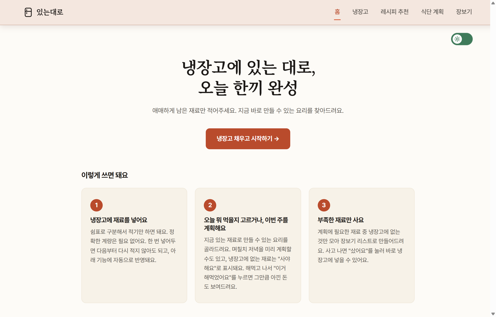
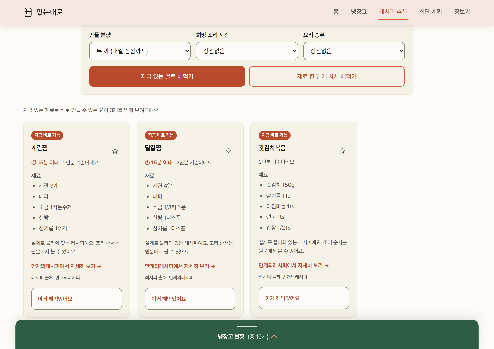
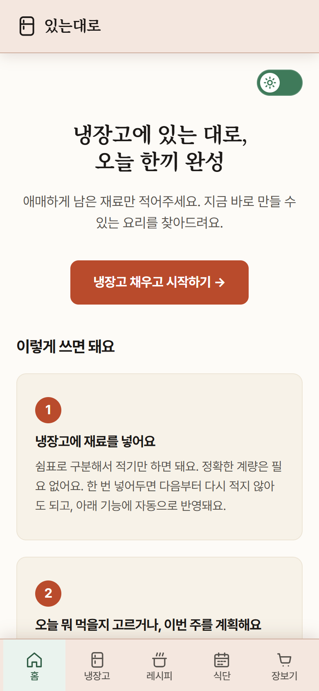
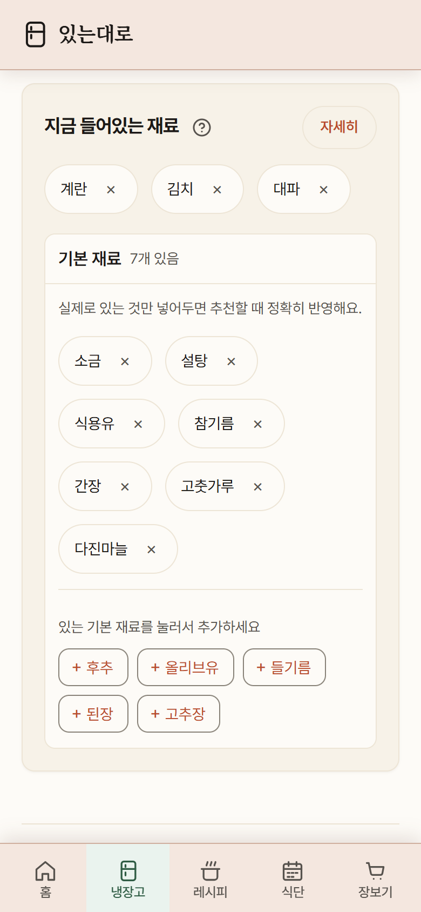

# 있는대로

> 냉장고에 있는 재료를 먼저 쓰고, 부족한 것만 사도록 돕는 1인 가구용 요리 생활 서비스


### ▶ **[fridge-chef-gamma.vercel.app](https://fridge-chef-gamma.vercel.app)** 에서 바로 써볼 수 있습니다

[GitHub 저장소](https://github.com/Frost0313z/fridge-chef) · [서비스 기획서](docs/서비스기획서.md) · [린 캔버스](docs/린캔버스.md)

---

## 무엇을 해결하나요

식비를 아끼려고 직접 요리해도, 냉장고에 뭐가 있는지는 잘 기억나지 않습니다.
무엇을 만들지 정하지 못하면 있는 재료를 두고 또 장을 보거나, 결국 배달을 시킵니다.

**있는대로**는 매일 반복되는 세 가지 질문에 답합니다.

> **1. 냉장고에 뭐가 있지?**  →  **2. 오늘 뭐 해먹지?**  →  **3. 다음에 뭘 사야 하지?**

이런 분들을 위해 만들었습니다.

- 혼자 살며 요리하지만 냉장고 재료를 자주 잊는 사람
- 배달비와 식비를 줄이고 싶은 20~30대 1인 가구
- 복잡한 재고 관리보다 빠른 추천과 간단한 기록을 원하는 사람

## 이렇게 생겼습니다



**"지금 있는 걸로 해먹기"** 를 누르면 장을 안 봐도 되는 요리만 올라옵니다.
카드마다 `지금 바로 가능` 배지가 붙고, 실제 레시피는 만개의레시피 원문으로 이어집니다.



모바일에서는 하단 내비게이션으로 다섯 화면을 오갑니다.
소금·간장 같은 **기본 재료는 접어둔 카드에서 따로 관리**하고, 실제로 있는 것만 등록합니다.

| 홈 | 냉장고 |
| :---: | :---: |
|  |  |

## 다섯 화면이 하나의 흐름입니다

| 화면 | 경로 | 하는 일 |
| --- | --- | --- |
| 홈 | `/index.html` | 서비스 안내, 냉장고 현황, 주간·월간 절약 금액 |
| 냉장고 | `/pantry.html` | 재료 넣고 빼기, 기본 재료 따로 관리, 사진으로 가져오기 |
| 요리 추천 | `/recipe.html` | 지금 있는 걸로 / 조금 사서, 실제 레시피 연결 |
| 식단 | `/mealplan.html` | 며칠치 저녁 계획, 메뉴 교체, 즐겨찾기, 완료 처리 |
| 장보기 | `/shopping.html` | 부족한 재료 통합, 구매 상태와 냉장고 반영 |

데스크톱은 상단, 모바일은 하단 내비게이션으로 이동합니다.

화면이 나뉘어 있어도 **냉장고 하나를 다섯 화면이 함께 봅니다.**

1. 냉장고에 재료를 넣습니다. 넣은 날짜는 자동으로 기록됩니다.
2. 지금 만들 수 있는 요리를 찾습니다.
3. 며칠치 저녁 식단을 짭니다.
4. 부족한 재료만 장보기 목록으로 모읍니다.
5. 요리를 마치면 쓴 재료가 냉장고에서 빠지고 절약 금액이 올라갑니다.

## 다른 레시피 서비스와 무엇이 다른가요

- **추천에서 끝나지 않습니다.** 재료 소비와 다음 장보기까지 이어집니다.
- **실제로 있는 레시피를 먼저 찾습니다.** 인공지능 생성은 마땅한 결과가 없을 때만 씁니다.
- **묻는 단계에서 목적을 나눕니다.** "지금 해먹을 것"과 "사서 해먹을 것"을 섞어 보여주지 않습니다.
- **자동으로 확정하지 않습니다.** 인공지능과 사진 분석 결과는 사용자가 확인한 것만 저장됩니다.

<details>
<summary>사용자의 문제와 해결 방식을 표로 보기</summary>

| 사용자의 문제 | 있는대로의 해결 |
| --- | --- |
| 뭐가 얼마나 있는지 기억나지 않는다 | 냉장고에 기록하고, 넣은 날짜로 오래된 것을 먼저 알린다 |
| 가진 재료로 뭘 만들지 안 떠오른다 | 목적을 두 버튼으로 나눠 선택을 단순하게 만든다 |
| 식단과 실제 냉장고가 따로 논다 | 미완료 식단과 현재 재료를 비교해 부족한 것만 뽑는다 |
| 요리했는데 재료가 냉장고에 그대로 남는다 | 쓴 재료를 확인 후 차감하고, 필요하면 되돌린다 |
| 직접 해먹은 효과가 체감되지 않는다 | 주간·월간·누적 절약 금액으로 보여준다 |

</details>

> 제품 목적과 기능 범위는 [서비스 기획서](docs/서비스기획서.md), 고객·문제·가치 가설은 [린 캔버스](docs/린캔버스.md)에 정리했습니다.

## 인공지능이 하는 일

### 1. 재료로 요리 추천하기

냉장고 재료, 원하는 분량, 요리 종류를 받아 요리를 골라줍니다.
**실제 레시피 인덱스를 먼저 검색하고**, 조건에 맞는 결과가 부족할 때만 OpenAI API를 호출합니다.

버튼이 둘인 것이 이 화면의 핵심입니다. 원하는 게 무엇인지는 사용자가 이미 알고 있으니까요.

- **지금 있는 걸로 해먹기** — 사러 나갈 필요가 없는 요리만 보여줍니다.
- **재료 한두 개 사서 해먹기** — 사야 하는 요리만, **적게 사도 되는 것부터** 보여줍니다.

한쪽에 결과가 없으면 다른 쪽 버튼을 눌러보라고 안내합니다.

### 2. 며칠치 저녁 식단 짜기

고른 기간과 냉장고 재료로 저녁 메뉴를 제안합니다.
결과는 직접 교체하고 확정할 수 있고, **아직 안 해먹은 식단의 부족 재료만** 장보기 목록에 올라갑니다.

### 3. 사진으로 재료 가져오기

영수증이나 장보기 내역 사진에서 재료 후보와 구매일을 뽑아냅니다.
분석 결과는 바로 저장되지 않습니다. 이름과 선택 상태를 확인한 항목만 냉장고에 들어갑니다.

### 기본 재료는 가정하지 않습니다

소금·간장·참기름 같은 기본 재료를 "당연히 있겠지"로 처리하지 않습니다.
냉장고 안의 접이식 카드에서 **실제로 있는 것만 등록**하고, 추천 커버율·"사야 해요" 판정·장보기 목록이
모두 그 등록 상태를 그대로 씁니다. 화면과 서버가 같은 사실을 말하게 하기 위해서입니다.

## 잘 안될 때는 이렇게 처리합니다

| 상황 | 처리 |
| --- | --- |
| 필수 입력이 비어 있음 | 무엇을 넣어야 하는지 알려주고 요청을 보내지 않음 |
| API가 4xx·5xx를 반환 | 기술 용어 없이 잠시 후 다시 시도하도록 안내 |
| 네트워크 끊김·응답 지연 | 로딩 상태를 표시하고, 타임아웃 뒤 재시도 방법 안내 |
| AI 응답 형식이 잘못됨 | 서버에서 형식을 검증하고 안전한 오류 응답으로 변환 |
| 레시피 인덱스가 없음 | 서비스를 멈추지 않고 AI 추천으로 전환 |
| 사진에서 재료를 못 찾음 | 냉장고를 건드리지 않고 다른 사진을 권함 |

직접 확인해보실 수 있는 시나리오입니다.

| 시나리오 | 입력 예시 | 기대 결과 |
| --- | --- | --- |
| 정상 추천 | 김치, 두부, 대파, 계란 | 요리 카드와 보유·부족 재료 표시 |
| 빈 입력 | 냉장고가 비어 있음 | 재료를 먼저 넣으라는 안내 |
| 긴 입력 | 재료와 조건을 여럿 입력 | 로딩 후 결과, 또는 타임아웃 안내 |
| 실제 데이터 | 인덱스와 맞는 재료 조합 | 출처와 만개의레시피 원문 링크 |
| API 실패 | 네트워크 차단 | 냉장고 데이터를 지키고 재시도 안내 |

## 직접 실행해보기

준비물은 **Git · Python 3 · Node.js · Vercel CLI · OpenAI API 키** 입니다.

```bash
# 1. 저장소 받기
git clone https://github.com/Frost0313z/fridge-chef.git
cd fridge-chef

# 2. 파이썬 패키지 설치
python -m pip install -r requirements.txt
```

**3. 환경 변수 설정** — `.env.example`을 복사해 `.env`를 만들고 키를 넣습니다.

```bash
OPENAI_API_KEY=여기에_발급받은_키_입력
```

> `.env`는 커밋하지 않습니다. 키를 README·자바스크립트·스크린샷에 노출하지 마세요.
> 노출이 의심되면 기존 키를 폐기하고 새로 발급합니다.

**4. 실행**

```bash
python -m http.server 8000   # 화면만 확인 (AI 기능은 안 됨)
vercel dev                   # 프론트 + 백엔드 전부
```

## 어떻게 만들었나

프레임워크도 번들러도 쓰지 않았습니다. 요청 하나가 이렇게 흘러갑니다.

```text
사용자 입력
    ↓
JavaScript가 입력을 검증하고 요청 데이터를 만든다
    ↓  fetch('/api/recommend' 등)
Vercel Serverless Function — api/index.py
    ↓
기능별 Python 모듈
    ├─ 실제 레시피 검색
    ├─ OpenAI API 호출
    └─ 응답 형식과 재료 검증
    ↓  JSON 응답
JavaScript가 로딩을 끄고 결과를 화면에 그린다
    ↓
사용자가 확정한 데이터만 localStorage에 저장
```

역할은 이렇게 나뉩니다.

- **HTML** — 제목, 입력 폼, 내비게이션, 결과 영역의 의미와 구조
- **CSS** — 반응형 레이아웃, 라이트·다크 테마, 상태별 시각 계층
- **JavaScript** — 입력 검증, fetch 요청, 응답 렌더링, 브라우저 저장
- **Python API** — 비밀 키를 지키며 OpenAI 호출, 레시피 검색, 응답 검증
- **Vercel** — 정적 프론트엔드와 서버리스 함수를 함께 배포

서버리스 함수는 늘 켜져 있는 서버 대신 요청이 올 때만 실행됩니다.
프론트엔드는 같은 도메인의 `/api/...`를 부르므로 **API 키가 브라우저에 나가지 않습니다.**

### 기술 선택

| 영역 | 기술 | 고른 이유 |
| --- | --- | --- |
| 화면 구조 | HTML5 | 프레임워크 없이 웹의 기본 구조를 직접 익히려고 |
| 디자인 | CSS3 | 반응형, 디자인 토큰, 다크 모드 |
| 상호작용 | Vanilla JavaScript | 입력에서 fetch, 화면 반영까지 흐름을 직접 구현 |
| 백엔드 | Python | 앞선 학습 내용 활용, 데이터 정규화와 API 처리 |
| 인공지능 | OpenAI API | 추천·식단·사진 분석 |
| 배포 | Vercel | 정적 파일과 Python 함수를 한 번에 |
| 데이터 | KADX 만개의레시피, localStorage | 실제 레시피 매칭, 서버 없는 상태 저장 |

### 폴더 구조

```text
fridge-chef/
├─ index.html               홈
├─ pantry.html              냉장고
├─ recipe.html              요리 추천
├─ mealplan.html            식단
├─ shopping.html            장보기
├─ css/
│  ├─ tokens.css            색·간격·폰트 토큰
│  └─ style.css             공통·반응형 스타일
├─ js/
│  ├─ shared.js             공통 저장·재료 처리
│  ├─ copy.js               사용자 문구 (모든 UI 텍스트)
│  └─ *.js                  화면별 로직
├─ api/
│  ├─ index.py              단일 진입점과 라우팅
│  ├─ recommend.py          요리 추천
│  ├─ mealplan.py           식단·장보기 계산
│  ├─ pantry_import.py      사진에서 재료 후보 추출
│  └─ recipe_match.py       실제 레시피 검색
├─ scripts/
│  ├─ build_recipe_index.py 레시피 인덱스 생성
│  └─ deploy.sh             인덱스 검사 후 프로덕션 배포
├─ docs/                    기획서·명세·증빙
├─ requirements.txt
└─ vercel.json
```

### API

| 방식 | 경로 | 역할 |
| --- | --- | --- |
| GET | `/api` | 서버 상태 확인 |
| POST | `/api/recommend` | 재료 기반 요리 추천 |
| POST | `/api/mealplan` | 저녁 식단 생성 |
| POST | `/api/shopping` | 확정 식단의 장보기 목록 재계산 |
| POST | `/api/pantryImport` | 사진에서 재료 후보 추출 |

모든 POST는 JSON을 쓰고, `api/index.py`가 기능별 모듈로 넘깁니다.

## 테스트

```bash
python api/test_handlers.py   # 서버 쪽
node js/test_amounts.js       # 화면 쪽
```

프레임워크 없이 `assert`만 씁니다. 두 파일이 함께 다음을 지킵니다.

- 빈 입력, 잘못된 AI 응답, API 내부 오류
- 실제 레시피 매칭과 인덱스 누락 폴백
- 재료명·수량·단위 정규화 (파이썬과 자바스크립트가 같은 답을 내는지)
- 식단과 장보기 부족분 계산
- 요리 완료와 되돌리기
- 주간·월간·누적 절약 계산
- 사진 분석 결과 필터링

화면을 고쳤으면 **모바일(390px)과 데스크톱(1920px), 각각 라이트·다크**에서
내비게이션·입력·로딩·결과·오류 상태를 확인합니다.

## 배포

Vercel 프로젝트의 **Settings → Environment Variables**에 `OPENAI_API_KEY`를 등록합니다.

레시피 인덱스는 데이터 라이선스와 파일 크기 때문에 GitHub에 올리지 않습니다.
그래서 **GitHub 푸시만으로는 배포가 끝나지 않고**, 인덱스를 확인하는 스크립트를 씁니다.

```bash
bash scripts/deploy.sh
```

이 스크립트가 확인하는 것은 ① 인덱스 파일 존재 ② 서버 코드와 인덱스 형식 버전 일치
③ 프로덕션 배포 성공 ④ 배포 URL의 기본 응답, 네 가지입니다.

문제가 생기면 배포 URL에서 기능을 다시 실행해보고, `vercel logs`로 함수 오류를 확인합니다.
로컬에서 같은 입력을 재현해 고치고, 테스트를 통과시킨 뒤 다시 배포합니다.
급하면 Vercel 대시보드에서 직전 정상 배포를 프로덕션으로 승격합니다.

> 로컬은 내 컴퓨터의 파일과 환경 변수를 읽지만, 배포 환경은 Vercel 빌드 결과와
> 등록된 환경 변수만 씁니다. 문제가 한쪽에서만 나는 이유는 대개 여기입니다.

## 지켜야 하는 선

**보안**

- OpenAI API 키는 Python 서버에서만 읽습니다.
- 키, `.env`, 원본 레시피 CSV, 개인 백업은 Git에 올리지 않습니다.
- AI 호출에는 과금이 있으므로 빈 입력과 중복 요청을 화면에서 먼저 막습니다.
- `localStorage` 값은 사용자가 바꾸거나 옛 형식일 수 있으므로 읽을 때 검증합니다.

**데이터 라이선스** — 실제 레시피 매칭에 KADX 만개의레시피 데이터를 씁니다. **CC BY-NC-ND**입니다.

- 재료·시간·인분 같은 사실 정보와 원문 링크만 씁니다.
- 원문의 소개글과 조리 순서는 복제하거나 재배포하지 않습니다.
- 원본 CSV와 생성한 인덱스는 공개 저장소에 넣지 않습니다.
- 이 데이터에 기대는 기능은 비상업적 범위에서만 운영합니다.

자세한 경계는 [레시피 매칭 명세](docs/spec-recipe-match.md)에 있습니다.

> 계정과 서버 데이터베이스는 아직 없습니다. 냉장고·식단·장보기 기록은 **쓰고 있는 브라우저에만**
> 저장되고 다른 기기와 자동으로 맞춰지지 않습니다.

## 문서

| 문서 | 내용 |
| --- | --- |
| [서비스 기획서](docs/서비스기획서.md) | 목적, 사용자, 페이지와 핵심 기능 |
| [린 캔버스](docs/린캔버스.md) | 고객·문제·가치·사업 가설과 검증 순서 |
| [UI·UX 원칙](docs/UIUX원칙.md) | 반응형, 접근성, 화면 구조 |
| [레시피 매칭 명세](docs/spec-recipe-match.md) | 실제 데이터, 라이선스, 매칭과 배포 |
| [사진 가져오기 명세](docs/spec-pantry-photo-import.md) | 입력·출력·확인 흐름 |
| [요리 완료·자동 반영 명세](docs/spec-auto-restock.md) | 냉장고·식단·절약 반영 |
| [AI 코딩 도구 사용 기록](docs/ai-coding-log.html) | 대화 로그 증빙 |

<details>
<summary><b>미션 요구 사항 충족 현황</b></summary>

| 평가 항목 | 구현 내용 | 상태 |
| --- | --- | :---: |
| 배포된 웹 서비스 | Vercel 프로덕션 URL 공개 | ✅ |
| 3개 이상 페이지 | 홈·냉장고·추천·식단·장보기 5개 화면 | ✅ |
| 메뉴 이동 | 데스크톱 상단, 모바일 하단 내비게이션 | ✅ |
| 반응형 | 모바일·태블릿·데스크톱 레이아웃 | ✅ |
| AI 입력 → 출력 | 추천·식단·사진 분석 | ✅ |
| 실패 처리 | 빈 입력·API 오류·타임아웃·잘못된 응답 | ✅ |
| 프론트·백엔드 분리 | HTML/CSS/JS와 `api/` Python 구조 | ✅ |
| 환경 변수 | `OPENAI_API_KEY`를 로컬·Vercel 환경 변수로 관리 | ✅ |
| GitHub 저장소 | 코드와 커밋 이력 공개 | ✅ |
| 서비스 기획서 | 목적·타겟·기능·지표 정리 | ✅ |
| 화면 증빙 | 데스크톱·모바일·추천 결과 이미지 | ✅ |
| AI 도구 사용 증빙 | 대화 기록 HTML 보관 | ✅ |
| 보너스 UX | 다크 모드, 상태 전환, 되돌리기 | ✅ |

</details>

## 만들면서 배운 것

- HTML·CSS·JavaScript가 구조·표현·동작으로 나뉘는 이유
- 사용자 입력이 fetch와 JSON 응답을 거쳐 화면에 닿기까지의 과정
- Vercel Serverless Functions에서 Python 백엔드가 도는 방식
- 환경 변수로 비밀 키를 브라우저와 저장소에서 떼어놓는 이유
- 로컬과 배포 환경의 차이를 추적하고 다시 배포하는 과정
- AI가 쓴 코드를 테스트·로그·재현 입력으로 검증하고 고치는 방법
- 실제 데이터의 라이선스를 **기능 설계 단계의 제약**으로 반영하는 방법
